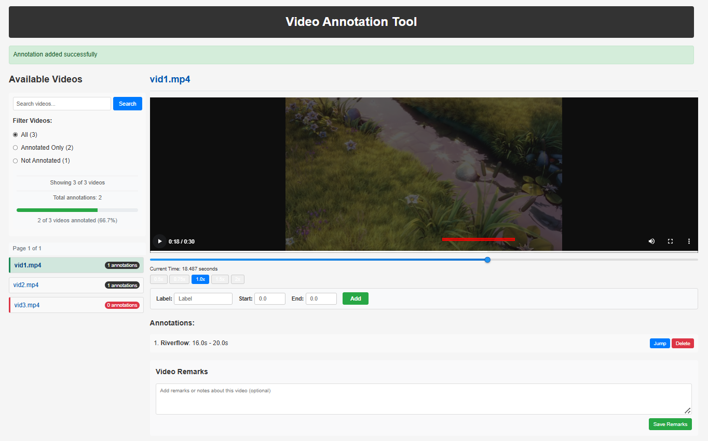

# Video Annotation Tool

A lightweight web application for annotating video files by marking segments with start and end times. Built with Python Flask and minimal JavaScript.



## Features

- **Video Management**: View, search, and filter videos (MP4, AVI, MOV, MKV)
- **Annotation**: Mark segments with start and end timestamps
- **Timeline Visualization**: Red markers show annotations on the video timeline
- **Filtering**: View all, annotated only, or unannotated videos
- **Search**: Find videos by filename or annotation labels
- **Pagination**: Navigate large video collections (500+ videos)
- **Path Normalization**: Automatic handling of path inconsistencies

## Getting Started

### Installation

1. Clone the repository:
   ```bash
   git clone git@github.com:maulikmadhavi/video_annotation.git
   cd video-annotation-tool
   ```

2. Install dependencies:
   ```bash
   pixi install
   ```

3. Add your videos to the `/videos` directory

### Running the Application

```bash
./run.sh
```

Or manually:
```bash
python backend/app.py
```

Access the tool at: http://127.0.0.1:5000

## Usage Guide

### Video Navigation

- Browse videos in the left sidebar
- Use the search box to find specific videos
- Filter using radio buttons: **All**, **Annotated Only**, or **Not Annotated**

### Creating Annotations

1. Select a video from the sidebar
2. Enter start and end times in seconds
3. Click "Add Annotation"

### Managing Annotations

- **Jump**: Move playhead to annotation's start time
- **Delete**: Remove the annotation

### Timeline Markers

- Red markers represent annotations on the timeline
- Click markers to jump to that position
- Hover for annotation details
- Use mouse scroll for navigation
- Use arrow keys to skip forward/backward 2-5 seconds

### Path Issues

If inconsistent file paths are detected, a warning will appear with a "Fix Path Issues" button.

## Data Storage

Annotations are stored in `backend/data/annotation.json`

## Utilities

Convert CSV/XLS data to JSON format:

```bash
python backend/convert_annotations.py --in-file backend/data/input.csv
```